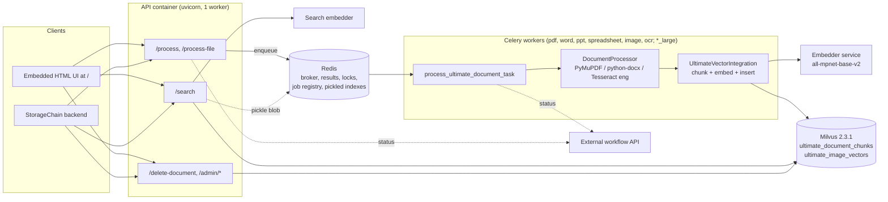
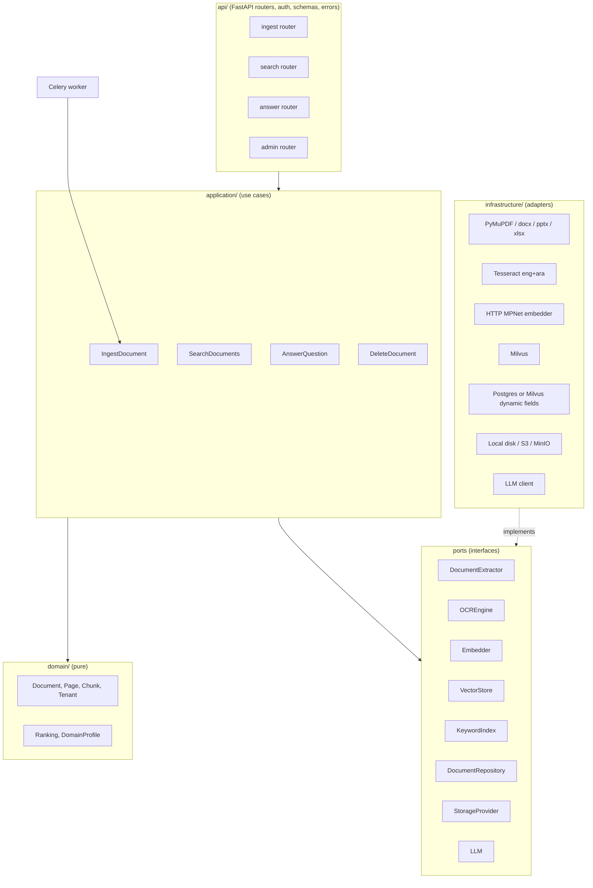

# xerox-ocr: Current-State Assessment and Modernization Plan

| | |
| --- | --- |
| Baseline assessed | `5876cf3`, import of the StorageChain `vector-storage-processing-service-python` snapshot |
| Regression suite | `06f0043`, `ultimate/tests` (see `ultimate/tests/README.md`) |
| Date | 2026-10-07 |

## 0. How this assessment was produced

Every application module was read (about 30,000 lines across 22 Python files, 5 compose files, 6 shell scripts). Claims were then checked by running the code wherever the environment allowed:

* **Executed:** Milvus `v2.3.1` standalone container configured exactly as in `docker-compose.ultimate.yml`, Redis 7, the application's Python code on Python 3.12 with the pinned dependency versions, Tesseract 5.3.4 with `eng` and `ara`. Ingestion ran through the real Celery task (`process_ultimate_document_task.apply`) and search through the real FastAPI app.
* **Not executed:** the Docker image build. This sandbox's network policy blocks `huggingface.co` and `download.pytorch.org`, so `all-mpnet-base-v2` and `BAAI/bge-reranker-base` could not be loaded. A deterministic stand-in embedder with the same `/embed` contract was used instead. **Plumbing, tenant scoping, exact/lexical behaviour and OCR were measured; the semantic quality of MPNet was not.**
* **No git history.** The repository was created from a zip export, so the "latest commit" is the snapshot itself and design intent could only be recovered from code comments.

Evidence labels used below: **VERIFIED** (reproduced by running code), **TRACED** (code path read end to end), **INFERRED** (reasoned from code, not confirmed).

Defect IDs (`KD-...`) match the strict-xfail tests in `ultimate/tests` where a test exists (17 have one: 16 pinned as strict xfail, plus KD-SEC-01 which is fixed and now guarded). Running `pytest --runxfail --tb=line` from `ultimate/` reproduces every VERIFIED unit-level defect.

---

## A. Executive summary

**What this is today.** A working ingestion and search service for one customer's legal and business corpus. Files are uploaded or fetched by URL, routed to per-file-type Celery queues, text is extracted (PyMuPDF, python-docx, Tesseract for images and scanned PDFs), chunked, embedded with all-mpnet-base-v2 through an HTTP embedder service, and stored in Milvus (HNSW, COSINE, 768 dims). Search combines Milvus vector search with filename and content scans plus a very large set of hand-written ranking rules.

**What works.** The core path from upload to Milvus to `/search` runs end to end. The four historical regression queries ("FOR IMMEDIATE RELEASE", "press release", "Lisa Riordan", "StorageChain") rank the right document first in vector, semantic and both modes (VERIFIED, stand-in embedder). Tenants with well-formed IDs are isolated. PDF, DOCX, TXT, spreadsheets and English scans are extracted correctly.

**Why it is not demo-ready or enterprise-ready yet.**

| # | Finding | Severity | Evidence |
|---|---|---|---|
| 1 | No authentication anywhere; `userId` from the request body is trusted | CRITICAL | TRACED |
| 2 | Tenant filter injection: a crafted `userId` returns every tenant's documents | CRITICAL | VERIFIED via `/search`; **fixed in `47cfedc`** |
| 3 | Anonymous cross-tenant delete (`/delete-document` with only `file_id`) and an unauthenticated admin purge | CRITICAL | VERIFIED |
| 4 | Redis published on `0.0.0.0:6379` without a password, and the API `pickle.loads` blobs from it: remote code execution for anyone who can reach the port | CRITICAL | TRACED |
| 5 | Milvus collections are auto-**dropped** on a dimension mismatch or any schema-check exception; the dimension is read from two different env vars | CRITICAL (data loss) | TRACED |
| 6 | A latent cross-tenant leak in the shared metadata index, currently disabled only by an accidental `NameError`; the obvious one-line fix turns the leak on | CRITICAL (latent) | VERIFIED |
| 7 | OCR is English-only (Arabic scans produce Latin garbage); no handwriting support | HIGH vs. target | VERIFIED |
| 8 | Page provenance is lost: pages are joined in thread-completion order and every chunk has `page_number=0`; scanned pages inside mostly-digital PDFs are never OCR'd | HIGH | VERIFIED |
| 9 | All extracted metadata (dates, persons, organizations, governing law) is computed and then thrown away before insert | HIGH | VERIFIED |
| 10 | A single slow search freezes the whole API including `/health` (8.6 s measured), and `/health` reports Celery/Redis healthy without checking | HIGH | VERIFIED |
| 11 | About 2,500 lines of query understanding and ranking are dead at runtime: `enhance_query` raises `ImportError` on every query (`LOCATION_PEERS` missing) and `MetadataIndex()` raises `NameError`; both are swallowed, so `/search` silently runs a much simpler path than the code suggests | HIGH (and a trap) | VERIFIED |

**The snapshot looks mid-refactor.** Finding 11 (two names that were moved or deleted without updating their importers), the README describing a `src/` pipeline that is not in the zip, and several historically described search techniques that cannot be found (see K) all point the same way. Production may be running different code, or may have been running this degraded path unnoticed because every failure is caught and logged as a warning. **Please confirm with the previous team before Phase 5.**

**Structural problem.** Search lives in two functions of 1,491 and 3,070 lines, with more than 400 corpus-specific rules (231 references to "NDA", 91 to "Austin", 88 to "Texas", named people and companies). That code is tuned to the previous customer's documents. On a Xerox corpus most of those rules either do nothing or misfire, and their behaviour is not covered by tests. This is the main reason changes in one place have broken search elsewhere.

**Recommendation.** Do not rewrite and do not split into microservices. Keep the stack (FastAPI, Celery, Redis, Milvus, MPNet) and the Milvus schema. Turn the code into a modular monolith behind a few explicit interfaces (`VectorStore`, `Embedder`, `OCREngine`, `DocumentExtractor`, `SearchPipeline`), in this order: security and data-safety fixes, regression tests (done), extraction of seams, OCR and page provenance, a clean demo compose profile, then RAG. The corpus-specific ranking rules should move behind a "domain profile" switch so a Xerox demo runs with a generic profile while the old behaviour stays reproducible.

**Already done in this session.**
1. Imported the code into `raviansalman/xerox-ocr` without any real keys (`ultimate/.env.example` is the template).
2. Added a 2-tier regression suite (90 tests; unit tier runs in about 5 s with no services) and a CI workflow. It freezes the Milvus contract and the four regression queries, and pins 16 verified defects as 24 strict-xfail test cases.
3. Fixed KD-SEC-01 (tenant filter injection, commit `47cfedc`), the first Phase 1 item. No change for well-formed IDs; the three strict-xfail tests flipped to passing and now guard the fix.

---

## B. Current architecture

### Repository structure

```
xerox-ocr/
├── readme.md                     # stale: describes a src/ "standard pipeline" that is not in this repo
├── .github/workflows/            # prod.yml / staging.yml deploy on self-hosted runners; byoc-prod.yml is empty
└── ultimate/
    ├── ultimate_ui.py            # 4,727 lines: FastAPI app + 1,650-line embedded HTML/JS UI + all routes
    ├── search_api.py             # search-only entrypoint (reuses ultimate_ui.create_fastapi_app)
    ├── Dockerfile.ultimate       # one image for API, workers and embedders; downloads models at build
    ├── docker-compose.ultimate.yml          # monolith (all Celery workers at replicas: 0)
    ├── docker-compose.processing-only.yml   # processing server (workers scaled, ports published)
    ├── docker-compose.search-only.yml       # search server, points at processing server's public IP
    ├── docker-compose.scale.override.yml    # generated; references services that do not exist
    ├── universal_deploy.sh       # 1,004-line generator for the processing/search split
    └── src/
        ├── ultimate_search_processor.py   # 3,727 lines: extraction + OCR (DocumentProcessor)
        ├── ultimate_tasks.py              # Celery ingestion task, locks, retries, workflow callbacks
        ├── ultimate_vector_integration.py # chunking, embedding, Milvus upsert, vector + filename search
        ├── vector_db_milvus_server.py     # Milvus schema, index, insert/search/query/delete
        ├── embeddings.py / embedder_service.py  # HTTP embedder client + MPNet embedder service
        ├── job_registry.py / scalability_utils.py / workflow_manager.py
        └── semantic/
            ├── semantic_pipeline.py       # 5,074 lines: SemanticPipeline.search_documents (3,070 lines)
            ├── semantic_components.py     # MetadataIndex, reranker, validators, entity extraction
            ├── query_enhancement.py       # enhance_query (925 lines of query rules)
            ├── constraint_ranking.py      # apply_constraint_boost (655 lines)
            ├── temporal_engine.py, semantic_utils.py, *.json (known orgs, locations)
```

### Runtime topology (as deployed)



### Actual dependency flow

```
/process-file ──► _choose_processing_queue (nested in create_fastapi_app)
              ──► Celery queue ultimate_<type>[_large]
              ──► process_ultimate_document_task
                    ├─ download_file (if URL)                 network
                    ├─ DocumentProcessor.process_document     extraction + OCR
                    ├─ IngestionTemporalNormalizer, EntityExtractor   (results discarded, KD-DATA-01)
                    └─ UltimateVectorIntegration.upsert_document
                         ├─ filename entity heuristics, temporal header
                         ├─ _chunk_text* (char based)
                         ├─ EmbeddingGenerator → HTTP embedder
                         └─ MilvusServerVectorDatabase.insert_chunks

/search ──► enhance_query ──┬─► UltimateVectorIntegration.search_documents ─► Milvus search
                            └─► SemanticPipeline.search_documents ─► Milvus search/query,
                                                                     cross-encoder rerank, validators
        ──► merge/dedupe ──► validators + 5 "supplements" (Milvus full scans) ──► constraint boosts
        ──► sort ──► zero-result fallbacks ──► response
```

### Where responsibilities are mixed

| Concern | Where | Notes |
|---|---|---|
| Business logic in routes | `ultimate_ui.py:2929-4420` (`/search`, 1,491 lines) | Merge, validation, four supplements, fallbacks, ranking keys, NDA rules, Texas metro pruning all inside one route closure |
| Routing logic inside the app factory | `_choose_processing_queue`, `_ranking_key`, `normalize_file_id_for_dedup` are closures in `create_fastapi_app` | Untestable without the HTTP layer |
| Database logic in business services | `ultimate_ui.py:3891` calls `vi.vector_db.query_all_chunks` directly; `semantic_pipeline` builds its own `MilvusServerVectorDatabase` | Milvus leaks into the API and the semantic layer |
| OCR coupled to orchestration | `ultimate_search_processor.process_document` calls the workflow API and, when captioning is on, writes to Milvus itself with `user_id="default_user"` | Extraction should be pure |
| Embedding coupled to search | `SemanticPipeline.__init__` hardcodes the model name; `vector_db_milvus_server` imports `src.embeddings` | Model choice is split across three modules |
| Milvus specifics everywhere | Expression strings built in 6 places; collection names and dims read from 4 different env vars | |
| Configuration scattered | 163 `os.getenv` reads of 102 distinct variables across 12 files, read at import time; 8 `logging.basicConfig` calls | Defaults disagree (e.g. `QUEUE_SHARD_COUNT` 8 in code, 0 in compose) |
| Shared mutable state | `vi._last_query_meta`, `SemanticPipeline._current_deadline`, `_CONTENT_SCAN_CACHE`, shared `MetadataIndex`, `_doc_embedding_cache` | Written per request on process-wide singletons |
| Global singletons | `get_global_semantic_pipeline`, `_GLOBAL_EMBEDDERS`, `_VECTOR_INTEGRATION`, module-level `app` | Hidden initialization order |
| Hidden side effects | `ultimate_tasks` sets `SKIP_IMAGE_CAPTIONING_IN_PROCESSOR=true` globally on import; `MilvusServerVectorDatabase.__init__` can drop collections | |
| Circular dependencies | `semantic_pipeline` ↔ `ultimate_vector_integration` ↔ `vector_db_milvus_server` ↔ `semantic_components`, broken with in-function imports | |
| Duplicated logic | Extension-to-MIME map defined 4 times; NDA term lists 6 times; filename decoding (`unquote(split('?'))`) about 20 times | |
| Error handling | 372 `except Exception`/bare `except` blocks, most of which log at debug level and continue | Failures become silently empty results |
| Weak typing | Requests are `dict`, not Pydantic models; results are dicts with 3 or 4 alternative key spellings (`file_id`/`source_file`/`object_id`) | |

---

## C. Current technology stack

| Layer | Technology | Version | Notes |
|---|---|---|---|
| Language | Python | 3.12 (image) | |
| API | FastAPI + uvicorn | 0.104.1 / 0.24.0 | Single module, no routers, no Pydantic request models |
| UI | Inline HTML/JS string in `ultimate_ui.py` | | Calls a non-existent `/collections` route |
| Jobs | Celery + Redis | 5.3.4 / Redis 7 | Per-file-type queues, `acks_late`, 15 retries |
| PDF | PyMuPDF | 1.23.26 | Direct text, page render for OCR |
| Office | python-docx, docx2python, antiword, python-pptx, ppt2txt, openpyxl, xlrd, odfpy | | |
| OCR | Tesseract via pytesseract | Debian 5.3 + `eng` only | OpenCV preprocessing for images |
| Embeddings | sentence-transformers `all-mpnet-base-v2` | 2.7.0 | 768 dims, English-only model, normalized |
| Reranker | `BAAI/bge-reranker-base` cross-encoder | transformers 4.41.1 | CPU; falls back to constant 1.0 scores if it cannot load |
| Vector DB | Milvus standalone | server 2.3.1, pymilvus 2.4.0 | Embedded etcd, local storage, HNSW + COSINE |
| NLP | spaCy `en_core_web_sm` | 3.7.2 | Disabled in compose (`ENABLE_QUERY_NER=0`) |
| Unused deps | qdrant-client, onnxruntime, tiktoken, langchain-text-splitters, beautifulsoup4, marshmallow | | Installed, not used on any live path |

---

## D. What actually works

* Upload and URL ingestion into type-specific Celery queues; queue routing table (VERIFIED, `test_api_contract.py`).
* Text PDFs, DOCX (including tables), TXT, HTML (as raw text), spreadsheets, PowerPoint extraction (VERIFIED for PDF/DOCX/TXT/HTML; TRACED for the rest).
* OCR of clean English scans, both image uploads and scan-only PDFs: 14/14 key terms on 8pt and 12pt text (VERIFIED).
* Chunking with a `[FILE: id] [FILE: name] |` header on every chunk, embedding through the embedder service, Milvus insert with user/bucket/path/connection scoping (VERIFIED).
* HNSW + COSINE vector search with Milvus-side `user_id` filtering for well-formed IDs (VERIFIED).
* The four regression queries return the press release first in vector, semantic and both modes; DOCX table content and Arabic plain text are retrievable (VERIFIED, stand-in embedder). They pass through the core path only (vector search, the semantic pipeline's vector + rerank, merge, phrase-first sort), because query enhancement and the supplements are not running (KD-SRCH-11).
* Filename and file-id lexical matching with stable score tiers 0.98 / 0.95 / 0.91 (VERIFIED).
* Delete by file and per-user purge (VERIFIED, though unauthenticated, see N).
* Job registry, heartbeat-based stuck-job detection, Redis lock against duplicate processing (TRACED).

## E. What partially works

* **Semantic search:** runs, but without query understanding (`enhance_query` fails on every call, KD-SRCH-11) and without metadata-first routing (`MetadataIndex()` always raises `NameError`, KD-SRCH-04). With no reranker model it scores every hit 1.0 (KD-SRCH-08).
* **Hybrid (`both`) mode:** vector + semantic run concurrently and merge. The validation block that holds the validators, supplements and constraint ranking calls `enhance_query` first, so it fails on every query and falls back to "filtered results without validation" (VERIFIED in the integration run logs).
* **Exact search on content:** designed to come from a "content scan" (1 to 4 word queries, only when the filename scan finds nothing, first 16,384 chunks only, KD-MLV-04). In this snapshot that scan never runs (KD-SRCH-11); exact phrases are found only through vector similarity plus the phrase-first sort key.
* **Image OCR:** works for English, but the cleaner rewrites real uppercase words (DIGITAL → DIGTAL, KD-OCR-01).
* **Metadata extraction:** dates, persons and organizations are extracted at ingest and then discarded (KD-DATA-01).
* **Deployment:** the processing/search split works for the previous customer but depends on public IPs and unauthenticated Redis/Milvus.

## F. What is broken

* Ownerless delete, unauthenticated purge (KD-SEC-02/03). Tenant isolation against crafted IDs (KD-SEC-01) was broken and is now fixed.
* Query understanding (`enhance_query`), the `/search` validators, supplements and constraint ranking: all fail on every query because `LOCATION_PEERS` no longer exists (KD-SRCH-11).
* PDF page order and page numbers (KD-OCR-02/03); OCR of scanned pages inside mixed PDFs (KD-OCR-05).
* Local (in-process) embedding: `SentenceTransformer` is never imported (KD-EMB-01). The system only works when `EMBEDDER_URL` points at the embedder service.
* `MetadataIndex` construction (`threading` not imported). This is "broken" in a way that currently protects tenants (KD-SRCH-04).
* `DocumentProcessor._normalize_text` corrupts every word (KD-OCR-07). It is unused for indexing, which is the only reason search is unaffected.
* `/process` validation errors return 500 with a server traceback (KD-API-01).
* `/health` always reports Celery and Redis healthy (KD-OPS-02).
* Re-ingesting a file duplicates its chunks (KD-DATA-02).
* The GitHub Actions deploy (`docker-compose.ultimate.yml`) starts zero Celery workers, so uploads would never be processed (KD-OPS-03). The metadata rebuild task goes to a queue nobody consumes (KD-OPS-04).

## G. What is missing

Arabic OCR, handwriting recognition, document classification, structured field extraction (invoice number, dates, parties), field-level confidence, human validation workflow, DMS/ERP connectors (only a proprietary workflow-stage callback exists), audit trail, authentication and role-based authorization, retention, RAG answer generation (no LLM anywhere), page/region citations, observability beyond logs, and any automated tests (until this session).

---

## 6. Functionality matrix

| Feature | Status | Evidence | Problems | Recommendation |
|---|---|---|---|---|
| File upload | PARTIALLY WORKING | VERIFIED `/process-file` | Whole file read into memory, no size or type limit, filename sanitizing only | Stream to disk with size cap and allowlist |
| URL ingestion | PARTIALLY WORKING | TRACED `download_file` | SSRF: fetches any URL incl. internal hosts; unbounded download | Allowlist schemes/hosts, size cap |
| PDF processing | PARTIALLY WORKING | VERIFIED | Page order scrambled, page numbers lost, mixed PDFs skip OCR, shared `fitz` doc across threads | Per-page results, deterministic order, per-page OCR decision |
| DOC/DOCX | WORKING (with gaps) | VERIFIED | Headers, footers, text boxes and embedded images ignored; tables appended after body | Walk body in order; OCR embedded images |
| OCR | PARTIALLY WORKING | VERIFIED | English only, hardcoded confidence 70, uppercase corruption | Language config, real confidence from `image_to_data` |
| Scanned documents | PARTIALLY WORKING | VERIFIED | Clean scans OK; mixed PDFs lose scanned pages; 108 DPI render | Per-page OCR, render at 300 DPI |
| Arabic text | NOT IMPLEMENTED (OCR) / PARTIALLY (text files) | VERIFIED | `lang='eng'`; `ara` not in image; MPNet is English-only | `eng+ara`, multilingual embedding model with migration |
| English text | WORKING | VERIFIED | | |
| Handwriting | NOT IMPLEMENTED | TRACED | No HTR engine | Separate phase, evaluate TrOCR / cloud HTR |
| Document parsing | WORKING | VERIFIED | Format detection duplicated 4 times | One `DocumentExtractor` registry |
| Text normalization | BROKEN (dead path) | VERIFIED | `_normalize_text` inserts `I` around every letter | Fix or delete; never index it |
| Chunking | WORKING | VERIFIED | Char-based; Word chunks 2x size can exceed MPNet's 384-token window | Token-aware chunking, page-aware |
| Metadata | BROKEN | VERIFIED | Extracted, never persisted | Persist as dynamic fields or a document store |
| Embeddings | PARTIALLY WORKING | VERIFIED | Only via HTTP embedder; local path `NameError` | Fix import, single `Embedder` interface |
| Milvus | WORKING | VERIFIED | Auto-drop on dim mismatch, unloaded full scans fail, 16,384 cap | Remove auto-drop, explicit load, paginate |
| Vector indexing | WORKING | VERIFIED | Non-idempotent upsert | Delete-then-insert per file |
| HNSW | WORKING | VERIFIED | M=32, efConstruction=200, ef=max(64, 2k) | Keep |
| Cosine similarity | WORKING | VERIFIED | | Keep |
| Exact search | PARTIALLY WORKING | VERIFIED | Filename-only lexical scan; content scan not running (KD-SRCH-11) and capped | Real keyword index (Milvus 2.5 BM25 or Postgres FTS) |
| Semantic search | PARTIALLY WORKING | VERIFIED (plumbing) | Query enhancement and metadata-first disabled by missing names; reranker fallback scores 1.0 | Fix behind tests and golden set |
| Hybrid search | PARTIALLY WORKING | VERIFIED | Ad hoc merge (+0.15 boost, dedupe by stripped file id) | Reciprocal rank fusion, explicit weights |
| Fuzzy / OCR search | NOT IMPLEMENTED (live path) | TRACED | Only fuzzy code is dead and runs on corrupted text | Trigram / edit-distance on OCR text |
| Result ranking | PARTIALLY WORKING | VERIFIED | 400+ corpus-specific rules, one result per file | Domain profiles, chunk-level results |
| Image indexing | PARTIALLY WORKING | TRACED | OCR text indexed; CLIP path off by default; caption path writes `user_id="default_user"` | Keep OCR path; fix tenant on caption path |
| User isolation | BROKEN | VERIFIED | Ownerless delete, no auth, latent metadata leak (injection fixed in `47cfedc`) | P0 fixes |
| RAG retrieval | NOT IMPLEMENTED | TRACED | Retrieval only, no LLM, no citations | Phase 6 |
| API endpoints | PARTIALLY WORKING | VERIFIED | Untyped bodies, 400→500, traceback leak | Pydantic models, error middleware |
| Authentication | NOT IMPLEMENTED | TRACED | `JWT_SECRET_KEY` defined, never read | API keys or OIDC |
| Authorization | NOT IMPLEMENTED | TRACED | | Tenant from token, not body |
| Persistence | PARTIALLY WORKING | TRACED | Milvus only; no document store, uploads deleted after processing | Object storage for originals |
| Error handling | PARTIALLY WORKING | TRACED | 372 broad excepts | Typed errors, fail loudly at boundaries |
| Logging | PARTIALLY WORKING | TRACED | Plain text, logs query text and user IDs | JSON logging, redaction |
| Docker | PARTIALLY WORKING | TRACED | Model download at build, workers off in main compose, public ports | Demo compose profile |
| Configuration | PARTIALLY WORKING | TRACED | 102 env vars, inconsistent defaults | One validated settings object |
| Tests | WORKING (new) | VERIFIED | Added this session | Extend per phase |

---

## H. Code quality assessment

| Metric | Value |
|---|---|
| Python lines (app) | ~30,000 |
| Functions over 300 lines | 13 |
| Functions over 100 lines | 42 |
| Largest functions | `SemanticPipeline.search_documents` 3,070; `create_fastapi_app` 2,868; `create_html_ui` 1,656; `/search` handler 1,491; `enhance_query` 925; `process_document` 754; `apply_constraint_boost` 655; `process_ultimate_document_task` 643 |
| Broad exception handlers | 372 |
| Env var reads | 163 reads, 102 distinct variables, 12 files |
| Tests before this session | 0 (`.gitignore` excluded `test_*.py`) |

Observations:

* **Readability:** long functions with underscore-prefixed locals (`_cs_`, `_ee_`, `_hf_`) used as manual namespaces, a clear sign the code wanted to be separate functions.
* **Dead code:** `DocumentProcessor.search_documents`, `_find_ultimate_matches`, `word_variations/synonyms/patterns` (always empty), `search_ultimate_documents_task`, `monitor_stuck_jobs` (no beat schedule), `zipapp` import, qdrant client.
* **Naming:** "Ultimate" prefix carries no meaning; "upsert" does not upsert; `search_lexical` is filename-only.
* **Documentation:** the root README describes a different service (`src/api.py`, `env.example`, `docker-compose.yml` that do not exist).
* **SOLID / DRY:** no interfaces; the same concepts (file id, filename decoding, MIME mapping, NDA detection) are reimplemented many times.

Detailed issues are in **Appendix A** in the requested format.

## I. Architecture assessment

* **Modularity:** low. Three modules (`ultimate_ui.py`, `semantic_pipeline.py`, `ultimate_search_processor.py`) hold about 45% of the code and every cross-cutting concern.
* **Coupling:** Milvus, the embedding model and corpus heuristics are referenced from API, worker and semantic layers. Changing the embedding model touches at least 5 files and can drop the collection (KD-MLV-01/02).
* **Testability:** core logic is either a closure inside the app factory or depends on singletons created at import. Characterization tests had to construct objects with `object.__new__` and patch module globals.
* **Concurrency model:** `async def` handlers call blocking code directly, so the event loop stalls (KD-OPS-01). Per-request state is written onto process-wide singletons (KD-SRCH-03).
* **Data model:** no document entity. A "document" exists only as chunks sharing a `file_id`. There is nowhere to keep pages, metadata, classification, status or audit history.
* **What is good and should be kept:** the Celery queue-per-type design, the embedder-as-a-service split (keeps workers small), Milvus-side tenant filtering, the filename-header-in-every-chunk trick, the Redis heartbeat and job registry, and bounded retries for Milvus outages.

## J. OCR assessment

| Question | Answer | Evidence |
|---|---|---|
| Engine | Tesseract (pytesseract), OEM 1 LSTM / OEM 3 | TRACED |
| Image preprocessing | Complexity analysis, then up to 6 OpenCV variants (contrast, sharpen, threshold, resize). Images are downscaled to 2000 px max; images over 8 MP or 2 MB are tiled | TRACED |
| PDFs | Sample first 3 pages; if they average more than 30 words, the whole PDF is treated as digital and **no page is OCR'd** | VERIFIED (KD-OCR-05) |
| Pages | Pages are processed in a thread pool and joined in completion order; all page results are collapsed into one blob | VERIFIED (KD-OCR-03): stored order `[6,5,1,4,7,2,9,3,8,10,11,12]` for a 12-page report |
| Page render for OCR | Zoom 1.5 = 108 DPI | VERIFIED. No recall loss measured on clean 8pt scans; remains a risk for degraded originals (INFERRED) |
| Normalization | `_clean_ocr_text` on image OCR; corrupts uppercase words with `I?I` patterns | VERIFIED (KD-OCR-01) |
| Error handling | Each failure falls through to another strategy; total failure yields success with empty text, which is indexed as a filename-only chunk | VERIFIED (KD-OCR-04) |
| Confidence | Hardcoded: 100 (digital), 70 (OCR), 95 (DOCX), 10 to 50 (fallbacks). Tesseract's per-word confidence is never read | VERIFIED |
| Language | `language='eng'` default; no caller passes another; `OCR_LANGUAGE` in README is never read; only `tesseract-ocr-eng` in the image | VERIFIED |
| Arabic | Not supported: Arabic scan gives Latin noise with 0 Arabic characters. Tesseract `ara` does read it, and `_clean_ocr_text` keeps Arabic characters, so the gap is configuration plus the image | VERIFIED (KD-OCR-06) |
| Handwriting | Not implemented | TRACED |
| Old/degraded documents | Generic contrast/threshold variants only; no deskew, denoise, dewarp or border removal | TRACED |
| Page-level metadata | None persisted (`page_number=0` everywhere) | VERIFIED (KD-OCR-02) |
| Document-level metadata | Extracted, then discarded | VERIFIED (KD-DATA-01) |

## K. Semantic search assessment (full query lifecycle)

1. **Request:** `POST /search` with an untyped dict: `userId`, `query`, `limit` (default 1000), `searchMethod` (default `SEARCH_DEFAULT_METHOD=both`), optional `bucketId`/`path`/`connectionId`, `search_type`, `semantic_mode`.
2. **Preprocessing:** `_normalize_temporal_phrasing`, then `enhance_query` (925 lines of rules) is meant to produce `query_meta`. **In this snapshot it raises `ImportError` on every call (KD-SRCH-11) and the caller substitutes `{original_query, normalized_query}`, so none of the following is detected:** `vector_query`, `normalized_query`, `intent_type`, `persons`, `locations`, `date`/`date_range`, `file_extensions`, `required_keywords`, `required_text_regex`, `needs_semantic`, `location_anchor_cities`. `vector` mode is silently upgraded to `both` when dates or entities are detected.
3. **Shared state write:** `vi._last_query_meta = query_meta` on the process-wide integration object (race between concurrent requests).
4. **Retrieval (both mode):** vector and semantic run in a 2-thread pool. Semantic only runs when `needs_semantic` is true; budgets `VECTOR_MAX_SECONDS_BOTH=20`, `SEMANTIC_MAX_SECONDS_BOTH=8` (semantic gets 80%).
   * **Vector path** (`UltimateVectorIntegration.search_documents`): embed the query through `EMBEDDER_SEARCH_URL`; Milvus HNSW search with `ef = max(64, 2k)`, `k = min(limit*5, 500)` then hard-capped at **50 chunks**; `expr = user_id == "..."` plus scope filters; keep the best chunk per file; add up to +0.25 for query-term overlap; cap at 1.0; enrich with temporal fields from text.
   * **Semantic path** (`SemanticPipeline.search_documents`): date/location/expired router (Milvus year scan still active; `metadata_index` paths inactive), Milvus vector search, `aggregate_by_document`, cross-encoder rerank on up to `max(2*top_k, 30)` documents, strictness profile `precision` thresholds, temporal/person/location validators.
5. **Merge:** dedupe by a normalized file id that strips `_`, `-`, spaces and extensions (two distinct files can collapse, KD-SRCH-10); semantic and metadata hits get +0.15 (capped at 0.99).
6. **Constraint prune (both mode):** required keywords, regex and city anchors; Texas metro peer rules. Currently a no-op (no `query_meta`).
7. **Score floor:** `SEARCH_MIN_SCORE` (0.0 in code, 0.05 in the env template); images need 0.5; "lexical" hits bypass the floor. Consequence: an unknown query still returns every document of the tenant (VERIFIED, KD-SRCH-06).
8. **Validation and supplements (non-vector modes, currently skipped: the block calls `enhance_query` first and falls back to a plain sort):** per-hit temporal/person/NDA validators, then NDA filename supplement, filename lexical supplement (Milvus full scan without text), content scan (full scan with text, cached 3 min per process), entity+extension supplement, hard extension filter, `apply_constraint_boost` (655 lines), sort by `(exact phrase in chunk, filename token hits, score)`, dedupe by decoded filename, person and brand trims.
9. **Fallbacks:** if nothing survives: vector with threshold 0, then year scan, then filename scan.
10. **Response:** one chunk per document (`file_id`, `text`, `similarity_score`, `confidence`, `search_method`, `metadata`) plus internal `query_meta` (debug data leaked to clients).

Correctness notes:

* **Embedding model and dimensions:** MPNet 768, normalized vectors, COSINE. Ingest reads `EMBED_MODEL_TEXT`/`EMBED_MODEL_DIM`, search hardcodes MPNet and reads `DOC_EMBED_DIM` (KD-MLV-02).
* **User filtering:** Milvus-side for vector and full-scan paths, unescaped (KD-SEC-01). Scope filters are not applied to the supplements (KD-SRCH-09).
* **Score semantics:** scores are not comparable across paths. Vector cosine, lexical tiers, boosted values and reranker sigmoid outputs are mixed and capped at 1.0 or 0.99.
* **Pagination:** none. `limit` defaults to 1000; there is no offset or cursor.
* **Duplicates:** re-ingested files are hidden by dedupe but double storage and skew full scans.
* **Historical techniques not found in this snapshot:** joined-form matching, ordered-word matching, OCR-similarity boosting and live fuzzy matching. What exists instead: exact phrase substring in the ranking key, word-boundary regexes for names, query-derived required keywords and regexes, a term-overlap boost and a 5-entry typo map. Since the README also describes a `src/` pipeline that is not in the zip, those features may live in another branch or repository. **Please confirm whether a fuller history exists before Phase 5.**

Refactoring must not change: model `all-mpnet-base-v2`, 768 dims, COSINE, HNSW M=32/efConstruction=200, the `ef` formula, the 50-chunk cap (until deliberately changed with tests), the collection names, the inserted field set, Milvus-side `user_id` filtering, the `[FILE: ...]` chunk header, the lexical score tiers and the `(phrase, filename hits, score)` sort key. All of these are now pinned by tests.

## L. Vector / Milvus assessment

| Item | Value | Verdict |
|---|---|---|
| Collections | `ultimate_document_chunks` (768), `ultimate_image_vectors` (512) | Keep |
| Schema | 13 fixed fields + dynamic fields enabled, VARCHAR PK `id` (truncated to 95 chars), 2 shards | Keep; stop truncating PKs |
| Index | HNSW, M=32, efConstruction=200, COSINE; FLAT fallback if creation fails | Keep; FLAT fallback should alert |
| Search | `ef=max(64, 2k)` or `MILVUS_SEARCH_EF` (48 in env template), `k<=50` | Keep; make cap explicit config |
| Consistency | Default (Bounded); no flush after insert | Fine for search; tests must flush |
| Load | Lazy; only `search_similar` loads; `query_all_chunks` fails on an unloaded collection | Fix (KD-MLV-03) |
| Full scans | `query(limit=16384)` without pagination, run per request for content scan, filename scan and index builds | Replace with an inverted index (KD-MLV-04) |
| Lifecycle | Auto-drop on dim mismatch or schema-check error | Remove immediately (KD-MLV-01) |
| Versions | Server 2.3.1, client 2.4.0 | Align server and client when upgrading; 2.4 adds sparse vectors, multi-vector hybrid search and grouping search, 2.5 adds built-in BM25 full-text search |
| Exposure | Port 19530 and 9091 published; search server connects over public IP | Private network or TLS + auth |

## M. RAG assessment

There is no RAG. No LLM client, prompt, answer generation or citation logic exists. What exists is a retrieval API that returns one chunk per document with a file id, which is a reasonable start for RAG but lacks: chunk-level results with page numbers and offsets, a stable document model for citations, authorization enforced from an authenticated identity, and prompt-injection handling for OCR'd content. Because the tenant boundary can currently be bypassed by request parameters (KD-SEC-01/04), building RAG on the current API would let an LLM retrieve other tenants' content. **Authorization must be fixed first.** In the target design the LLM never chooses the tenant; the retrieval layer derives it from the authenticated principal and filters in Milvus before any text reaches the model.

## N. Security assessment

| Area | Finding | Severity |
|---|---|---|
| Authentication | None on any route. README's `api_key` parameter does not exist in code | CRITICAL |
| Authorization | Tenant is whatever `userId` the caller sends | CRITICAL |
| Injection | `user_id` interpolated unescaped into Milvus expressions; crafted ID returned all tenants (VERIFIED). **Fixed in `47cfedc`** | CRITICAL (fixed) |
| Deletion | `/delete-document` works without `user_id` and deletes across tenants; also retries without bucket/path/connection filters if the first attempt matched nothing (VERIFIED) | CRITICAL |
| Admin | `/admin/purge-user-vectors`, `/admin/vector-storage-by-user` open unless `VECTOR_STATS_ADMIN_KEY` is set (not set in any env file); `/admin/jobs/{user_id}` never protected | CRITICAL |
| Redis | Published on `0.0.0.0:6379` without password in both monolith and processing compose; search server reads `pickle` blobs from it (`MetadataIndex._load_state_from_redis`) = RCE; also full document text of every tenant stored there for 30 days | CRITICAL |
| Milvus | Published on 19530/9091 without auth; search server talks to it over the public internet | HIGH |
| Latent leak | Shared `MetadataIndex` mixes tenants once `threading` is imported (VERIFIED with simulated fix) | CRITICAL (latent) |
| SSRF | `/process` downloads any `fileUrl`, including internal addresses and cloud metadata endpoints | HIGH |
| Uploads | No size limit, no type allowlist, whole body read into memory; downloads unbounded | HIGH |
| XSS | UI inserts document text into `innerHTML` unescaped; HTML uploads are indexed with their markup (TRACED; markup storage VERIFIED) | HIGH |
| Error disclosure | Full traceback returned by `/process` (VERIFIED) | HIGH |
| Secrets | Real keys were present in the source env files; excluded from this repo. They should be considered exposed and rotated | HIGH |
| CORS | `allow_origins=["*"]` with `allow_credentials=True` | MEDIUM |
| Paths | `user_id` used in cache file names (`metadata_index_{user_id}.pkl`) and Redis keys without validation | MEDIUM |
| Lock scope | `process_lock:{file_id}` not namespaced by tenant | MEDIUM |
| Logging | Queries, user IDs and file URLs (including presigned S3 signatures) logged at INFO | MEDIUM |
| Prompt injection | Not applicable yet (no LLM); OCR'd content will need treatment as untrusted in Phase 6 | n/a |

## O. Docker / deployment assessment

* **Can it start with `docker compose up --build`?** Not as-is. The default `env_file` is `docker.staging.env`, which is not in the repo (it held secrets); copying `.env.example` to that name fixes it. The build then downloads MPNet and bge-reranker from Hugging Face (fails offline or behind a proxy), and all six Celery worker services are `replicas: 0`, so the stack starts but never processes uploads.
* **Images:** one multi-GB image (size not measured here) for API, workers and embedders (torch CPU, models baked in). `build-essential` and `python3-dev` stay in the final image.
* **Health checks:** API and Redis yes; Milvus yes; embedder yes; workers none. API health is not a real readiness check.
* **Startup ordering:** API `depends_on` Milvus/Redis without `condition: service_healthy`.
* **Volumes:** bind mounts under `./data`; source code is also bind-mounted over the image (`./src:/app/src`), so the image is not what runs.
* **Networking:** Redis and Milvus published to the host in two compose files.
* **Resource limits:** set, but Redis is capped at 200 to 300 MB while it also stores every tenant's pickled index with full text.
* **CI/CD:** `prod.yml`/`staging.yml` deploy with `sudo git pull` + `docker-compose down/up` on self-hosted runners. `byoc-prod.yml` is empty. `docker-compose.scale.override.yml` targets service names that do not exist.

## P. Demo readiness assessment

Things that would fail or embarrass in a live demo today:

1. Uploads never complete if the main compose file is used (no workers).
2. A Hugging Face hiccup during build, or no internet at the venue.
3. Arabic document: Latin garbage in the results.
4. A scanned page at the end of a digital PDF is unsearchable.
5. "Show me the page" is impossible: page numbers are all 0 and page order is scrambled.
6. Searching a nonsense word returns every document with a score.
7. With the reranker missing, every semantic hit shows 100%.
8. One slow query freezes the UI and health page; Docker may mark the API unhealthy mid-demo.
9. Uppercase words in scanned images (DIGITAL, DEFINITIONS) cannot be found by exact search.
10. The UI renders HTML from documents.
11. Extracted metadata cannot be shown because it is not stored.
12. Re-uploading the demo file creates duplicates.

## Q. Technical debt (ranked)

1. 4,500 lines of search logic in two functions with corpus-specific rules (no tests until now).
2. Milvus access scattered with string-built expressions and destructive auto-migration.
3. No document entity: pages, metadata, status and provenance have nowhere to live.
4. Configuration read at import time from 102 env vars with conflicting defaults.
5. Blocking work inside async handlers; per-request state on singletons.
6. 372 broad exception handlers turning failures into empty results.
7. Embedded HTML UI inside the API module.
8. Dead code and unused dependencies (fuzzy layer, qdrant, onnx, langchain splitters, tiktoken).
9. Deployment scripts tied to specific AWS IPs.
10. Stale README.

---

## R. Refactoring plan

Strategy: **strangler-style modular monolith.** New modules are introduced behind interfaces, and existing functions become thin adapters that call them. Each step is one bounded area, guarded by the characterization tests, and merged only when the unit and integration tiers are green and any flipped known-defect markers are removed deliberately.

Order of seams (lowest risk first):

1. **Settings:** a single `pydantic-settings` object that reads the same env var names and defaults. Pure move; tests prove identical values.
2. **Milvus adapter (`VectorStore`):** wrap `MilvusServerVectorDatabase`. Centralize expression building with escaping (fixes KD-SEC-01). Remove auto-drop (fail fast with a clear message instead). Explicit `ensure_loaded` for queries. Paginated scans with an iterator.
3. **Embedder:** one `Embedder` interface with `HttpEmbedder` (today's path) and `LocalEmbedder` (fixed import). Model name and dimension come from settings in one place.
4. **Extraction (`DocumentExtractor` registry):** move PDF/DOCX/PPTX/XLSX/TXT/image extractors out of `process_document` into one class per format, returning `ExtractedDocument(pages=[Page(number, text, method, confidence)])`. The old `UltimateSearchResult` is built from it for compatibility.
5. **Ingestion pipeline:** `IngestDocument` use case (download → extract → enrich → chunk → embed → store), with the Celery task as a thin adapter. Make store idempotent (delete existing chunks for `(user_id, file_id)` first).
6. **Search pipeline:** split the `/search` handler into named stages (`QueryAnalyzer`, `VectorRetriever`, `SemanticRetriever`, `Merger`, `Validator`, `Supplements`, `Ranker`, `Fallbacks`) with the exact current logic moved, not rewritten. Corpus-specific rules move into a `DomainProfile` (`legacy_storagechain` reproduces today's behaviour; `generic` for Xerox demos).
7. **API layer:** routers per area, Pydantic request/response models, auth dependency, error middleware, `def` (threadpool) handlers instead of blocking `async def`.
8. **UI:** move the HTML to static files; escape all document text.

## S. Prioritized backlog

| ID | Item | Phase | Size | Risk to search |
|---|---|---|---|---|
| P0-1 | ~~Escape tenant and scope values in every Milvus expression (KD-SEC-01)~~ **Done (`47cfedc`)** | 1 | S | None for valid IDs |
| P0-2 | Bind Redis and Milvus to the internal Docker network; Redis password; replace pickle with JSON (KD-SEC-05) | 1 | S | None |
| P0-3 | Remove collection auto-drop; single source for model, dim and collection names (KD-MLV-01/02) | 1 | S | None |
| P0-4 | Require `user_id` on delete and never retry delete without scope; admin key mandatory (KD-SEC-02/03) | 1 | S | API change for clients that omit `user_id`; confirm with backend owner |
| P0-5 | Rotate the keys that were in the original env files | 1 | S | None |
| P0-6 | Authentication (API key per tenant or OIDC) and tenant derived from the credential (KD-SEC-04) | 7 | M | API contract change |
| P1-1 | `/process` returns 400 for validation, no tracebacks (KD-API-01) | 1 | S | None |
| P1-2 | Real `/health/live` and `/health/ready` (KD-OPS-02) | 1 | S | None |
| P1-3 | Handlers as sync `def` or `run_in_threadpool`; more uvicorn workers (KD-OPS-01) | 1 | S | None |
| P1-4 | Per-page extraction with deterministic order and `page_number` (KD-OCR-02/03) | 4 | M | Changes chunk boundaries; re-index needed |
| P1-5 | Per-page OCR decision for mixed PDFs, 300 DPI render (KD-OCR-05) | 4 | S | More text indexed |
| P1-6 | OCR languages `eng+ara`, `tesseract-ocr-ara` in image, real confidence (KD-OCR-06) | 4 | S | None for English |
| P1-7 | Fix `_clean_ocr_text` uppercase rule (KD-OCR-01) | 4 | S | Changes indexed text for images |
| P1-8 | Persist extracted metadata as dynamic fields (KD-DATA-01) | 4 | S | None |
| P1-9 | Idempotent upsert (KD-DATA-02) | 5 | S | None |
| P1-10 | Fix `query_all_chunks` load; paginate scans (KD-MLV-03/04) | 5 | M | Recall increases for big tenants |
| P1-11 | Demo compose profile with workers, healthchecks, offline models | 8 | M | None |
| P2-1 | Split `/search` and `search_documents` into stages without behaviour change | 3 | L | Guarded by tests |
| P2-2 | Domain profiles: legacy vs generic ranking rules | 5 | M | Generic profile changes ranking by design |
| P2-3 | Score floor and "no results" UX (KD-SRCH-06) | 5 | S | Fewer weak results |
| P2-4 | Proper keyword index (Milvus 2.5 BM25 full-text search, or Postgres FTS) and RRF fusion | 5 | L | Ranking change, needs golden set |
| P2-5 | Multilingual embeddings (e.g. `paraphrase-multilingual-mpnet-base-v2`, 768 dims) in a **new** collection with dual-read migration | 5 | L | High; needs evaluation |
| P2-6 | Document classification + structured field extraction with confidence | 4/9 | L | None |
| P2-7 | RAG endpoint with citations and authorization-before-retrieval | 6 | L | None |
| P3-1 | Fix or delete `_normalize_text` and the dead fuzzy layer (KD-OCR-07) | 3 | S | None |
| P3-2 | Fix `threading` import **together with** per-tenant metadata indexes (KD-SRCH-04) | 5 | M | Re-enables metadata-first; needs tests |
| P3-5 | Decide what to do with the dead query-understanding stack: restore `LOCATION_PEERS` behind the legacy domain profile only, or retire it (KD-SRCH-11) | 5 | M | Restoring it switches on ~2,500 lines of corpus-specific behaviour |
| P3-3 | Remove unused deps; slim image; non-root user | 8 | S | None |
| P3-4 | Rewrite README for xerox-ocr | 9 | S | None |

## T. Recommended target architecture



Proposed layout (inside `ultimate/src/xerox_ocr/`, created gradually; old modules become adapters until removed):

```
xerox_ocr/
├── config.py                 # Settings (pydantic-settings), validated at startup
├── api/                      # routers: ingest.py, search.py, admin.py, health.py; auth.py; schemas.py
├── application/              # ingest_document.py, search_documents.py, delete_document.py
├── domain/                   # models.py (Document, Page, Chunk), ranking/, profiles/
├── ports.py                  # Protocols below
└── infrastructure/
    ├── milvus_store.py       # wraps today's MilvusServerVectorDatabase
    ├── embedder_http.py      # wraps today's EmbeddingGenerator
    ├── extractors/           # pdf.py, office.py, image.py, text.py
    ├── ocr_tesseract.py
    └── celery_tasks.py
```

Key interfaces:

```python
class VectorStore(Protocol):
    def upsert_document(self, tenant: TenantScope, doc_id: str, chunks: list[Chunk], vectors: np.ndarray) -> int: ...
    def search(self, tenant: TenantScope, vector: np.ndarray, k: int) -> list[ChunkHit]: ...
    def scan(self, tenant: TenantScope, fields: list[str]) -> Iterator[ChunkRecord]: ...   # paginated
    def delete_document(self, tenant: TenantScope, doc_id: str) -> int: ...

class Embedder(Protocol):
    model_name: str
    dimension: int
    def embed(self, texts: list[str]) -> np.ndarray: ...   # L2-normalized

class OCREngine(Protocol):
    def recognize(self, image: Image.Image, languages: list[str]) -> OCRResult: ...   # text + word confidences

class DocumentExtractor(Protocol):
    def supports(self, mime: str, ext: str) -> bool: ...
    def extract(self, path: Path) -> ExtractedDocument: ...   # ordered pages with method and confidence
```

`TenantScope` is created only by the auth layer, so a request body can no longer choose the tenant.

## U. Testing strategy

| Level | Scope | Status |
|---|---|---|
| Unit | Milvus contract, chunking, lexical tiers, normalization, OCR cleaning, routing, request validation, query understanding | Added (48 passing + 18 strict-xfail cases) |
| Integration | Real Milvus + Redis + stand-in embedder; ingest PDF/DOCX/TXT/Arabic; regression queries in all modes; isolation; delete/purge; re-ingest | Added (18 passing + 6 strict-xfail cases) |
| Golden semantic set | Same queries against the real MPNet stack in Docker, with expected top-k per query; run before any ranking change | Phase 2: needs the Docker build with model access |
| OCR quality | Corpus of real scans (Xerox samples, Arabic invoices, degraded copies); character error rate and key-field recall per engine/config | Phase 4 |
| End-to-end | `docker compose` demo profile: upload via API, poll task, search, assert page citation | Phase 8 |
| Security | Crafted IDs, ownerless delete, admin without key, SSRF targets, oversized upload, XSS payload in document | Partly added as known defects |
| Load | 30 concurrent searches during ingestion; health latency budget | Phase 10 |

Rules: every behaviour change flips a known-defect test or updates a characterization assertion in the same PR, with the reason in the PR description; ranking changes require the golden set.

## V. Demo plan (deterministic)

Prepared once: demo compose profile, models baked into the image (or a local model volume), a fixed demo tenant API key, and a fixed corpus checked into `demo/corpus/` (English press release PDF, mixed digital+scanned contract, Arabic invoice scan, DOCX invoice, a TIFF from a Xerox device). A `make demo-reset` target drops and re-ingests the corpus.

1. `docker compose --profile demo up -d`; show `/health/ready` green for API, workers, Milvus, Redis, embedder.
2. Upload the mixed contract through the UI; show the job moving queued → processing → done.
3. Open the document view: per-page OCR text with method and confidence, the scanned appendix page included.
4. Show extracted metadata: document type, dates, parties, amounts, each with confidence.
5. Show indexing: chunk count per page, Milvus collection stats.
6. Exact search: "FOR IMMEDIATE RELEASE", with the hit highlighted on page 1.
7. Semantic search: "who handles media enquiries" finding Lisa Riordan.
8. Hybrid search: show fused ranking and why each hit ranked (vector vs keyword contribution).
9. Click through to the source page image.
10. RAG: ask a question; answer with page-level citations (Phase 6).
11. Access boundary: same query with a second tenant's key returns nothing.
12. Health/metrics page.

Fallbacks: a pre-recorded run of the same script, and the demo corpus already indexed in a snapshot volume so step 2 can be skipped if the network is down.

## W. Risks

| Risk | Impact | Mitigation |
|---|---|---|
| Fixing one defect re-enables another path (e.g. the `threading` import re-enables the tenant-leaking metadata index) | High | Known-defect tests; pair such fixes (P3-2) |
| Changing chunking or extraction changes ranking for existing tenants | High | Re-index into a new collection; golden set comparison before cutover |
| Multilingual model needs a re-embed of all data | High | New collection + dual read; keep MPNet collection until verified |
| Real semantic quality not yet measured (model download blocked here) | Medium | Golden set on the Docker stack first thing in Phase 2 |
| Snapshot may not be the full history or the deployed version (missing `src/` pipeline, missing `LOCATION_PEERS` and `threading` imports, some search techniques absent) | High | Confirm with the previous team; diff against the production containers and any other branch before Phase 5 |
| Existing StorageChain clients depend on lax API behaviour (optional `user_id` on delete, open admin) | Medium | Version the API; announce changes |
| Exposed keys from the original env files | High | Rotate now |
| Arabic OCR quality on real scans with Tesseract may be insufficient | Medium | Benchmark early; evaluate alternative engines behind `OCREngine` |
| Handwriting expectations in the demo | Medium | Position as a later phase; do not imply it exists |

---

## Scorecard

| Area | Score | Evidence |
|---|---|---|
| Architecture | 3/10 | Queue-per-type and embedder service are sound; everything else lives in three oversized modules with no seams |
| Code quality | 2/10 | 13 functions over 300 lines, 372 broad excepts, duplicated logic, dead code, misleading names |
| Modularity | 2/10 | Milvus, model and corpus rules referenced from every layer; logic in closures |
| OCR | 4/10 | Clean English scans perfect; English only, mixed PDFs lose pages, uppercase corruption, fake confidence |
| Document intelligence | 2/10 | No classification, no field extraction, extracted entities discarded |
| Metadata extraction | 2/10 | Extraction exists but is never persisted |
| Vector search | 6/10 | Solid HNSW/COSINE setup with tenant filtering; injection, 50-chunk cap, auto-drop |
| Semantic search | 4/10 | Works for the regression queries; query understanding and metadata routing dead at runtime; overfitted rules; reranker fallback 1.0 |
| Hybrid search | 4/10 | Concurrent merge works; ad hoc weighting, filename-only lexical, capped content scan |
| RAG | 1/10 | Retrieval only, no citations, unsafe tenant boundary |
| Security | 1/10 | No auth, anonymous delete, open admin, public Redis with pickle (tenant filter injection now fixed) |
| Testing | 1/10 → 5/10 | None before; now 90 tests incl. integration and pinned defects |
| Observability | 2/10 | Logs only; fake health; Prometheus counters defined but not exposed |
| Docker | 4/10 | Builds a working image online; workers off, public ports, models fetched at build |
| Deployment | 3/10 | Works for one AWS setup via public IPs; CI deploy broken |
| Performance | 4/10 | Event-loop blocking, per-request 16k-row scans, CPU cross-encoder |
| Demo readiness | 3/10 | Regression queries work; at least 12 visible failure points |
| Production readiness | 2/10 | Security and data-safety blockers |

---

## Implementation plan

### Phase 0: Understand and baseline (done)
* **Files:** none changed in the app. Added `ultimate/tests/**`, `pytest.ini`, `requirements-test.txt`, `.github/workflows/tests.yml`, `.gitignore`.
* **Acceptance:** unit tier green in under 10 s; integration tier green against Milvus 2.3.1; 16 defects pinned as 24 strict-xfail cases.

### Phase 1: Stabilize (security and data safety, no ranking changes)
* **Files:** `vector_db_milvus_server.py` (escape all expressions, remove auto-drop, load before query), `ultimate_ui.py` (delete requires `user_id`, admin key mandatory, `/process` errors, real health, `def` handlers), `semantic_components.py` (JSON instead of pickle), compose files (no published Redis/Milvus ports, Redis `requirepass`), `.env.example`.
* **Dependencies:** agreement from the StorageChain backend owner for the delete/admin contract change; key rotation.
* **Regression risk:** low; only invalid or malicious inputs change behaviour.
* **Tests:** flip KD-SEC-02/03, KD-API-01, KD-OPS-01/02, KD-MLV-03 (KD-SEC-01 already flipped in `47cfedc`); add tests for no-auto-drop.
* **Not in this phase:** KD-SRCH-04 and KD-SRCH-11. They look like one-line fixes but change search behaviour broadly; they belong to Phase 5 with the golden set.
* **Acceptance:** all regression queries unchanged; crafted IDs return nothing; health reflects real dependency state; no published data-store ports.

### Phase 2: Tests and regression protection
* **Files:** `ultimate/tests/golden/` with queries and expected top-k; a script that runs them against a Docker stack.
* **Dependencies:** Docker build with model access (allow `huggingface.co` and `download.pytorch.org`).
* **Regression risk:** none (tests only).
* **Tests:** golden semantic set for the 4 regression queries plus 30 representative queries per corpus.
* **Acceptance:** golden results recorded from the current code before any Phase 3 change.

### Phase 3: Modular architecture (moves, not rewrites)
* **Files:** new `src/xerox_ocr/{config,ports,domain,application,infrastructure,api}`; `ultimate_ui.py` routes delegate; `/search` handler split into stages moved verbatim; `semantic_pipeline.search_documents` split along its existing sections; delete dead fuzzy layer.
* **Dependencies:** Phase 2 golden set.
* **Regression risk:** medium (large moves); mitigated by moving code without editing it and by the tests.
* **Tests:** all existing tests and the golden set identical before/after each move; new unit tests per stage.
* **Acceptance:** no function over 150 lines in new modules; Milvus imported only in `infrastructure/`; `os.getenv` only in `config.py`.

### Phase 4: OCR and document intelligence
* **Files:** `infrastructure/extractors/pdf.py` (ordered per-page results, per-page OCR decision, 300 DPI), `ocr_tesseract.py` (`eng+ara`, `image_to_data` confidence, deskew/denoise), `Dockerfile` (`tesseract-ocr-ara`), chunker (page-aware), metadata persistence, classification + field extraction module.
* **Dependencies:** Phase 3 extractor seam; real scan corpus.
* **Regression risk:** high for ranking (more and differently ordered text); index into a new collection and compare with the golden set before switching.
* **Tests:** flip KD-OCR-01..06, KD-DATA-01; OCR quality benchmark with CER and key-field recall.
* **Acceptance:** Arabic scans searchable; page citations correct; scanned appendix found; extracted fields stored with confidence.

### Phase 5: Vector, semantic and hybrid search
* **Files:** `application/search_documents.py`, `domain/ranking`, `domain/profiles/{legacy_storagechain,generic}.py`, keyword index adapter, RRF merger, idempotent upsert, paginated scans, per-tenant metadata index (with the `threading` fix).
* **Dependencies:** Phases 2 to 4.
* **Regression risk:** high by design for the generic profile; none for the legacy profile.
* **Tests:** golden set per profile; KD-DATA-02, KD-MLV-04, KD-SRCH-04/06 flipped; tenant leak test for the metadata index.
* **Acceptance:** legacy profile reproduces golden results; generic profile meets agreed precision@5 on the Xerox corpus; unknown queries return nothing.

### Phase 6: RAG and retrieval
* **Files:** `application/answer_question.py`, `ports.LLM`, prompt templates, citation model.
* **Dependencies:** Phase 4 page provenance, Phase 7 authorization (or at least Phase 1 tenant fixes).
* **Regression risk:** none for search.
* **Tests:** answers cite only chunks from the caller's tenant; prompt-injection payloads inside documents do not change system behaviour; "no answer" when retrieval is empty.
* **Acceptance:** every answer sentence links to document and page; cross-tenant test suite passes.

### Phase 7: Security and authorization
* **Files:** `api/auth.py`, tenant resolution, role checks (`reader`, `uploader`, `admin`), audit log, SSRF guard, upload limits, CORS allowlist, log redaction, UI escaping.
* **Dependencies:** identity choice (API keys first, OIDC later).
* **Regression risk:** API contract change; versioned.
* **Tests:** flip KD-SEC-04/06; SSRF, oversized upload, role tests.
* **Acceptance:** no route reachable without credentials except liveness; tenant never taken from the body.

### Phase 8: Dockerization and deployment
* **Files:** multi-stage `Dockerfile` (non-root, slim runtime), `docker-compose.yml` with `demo` profile (API, 1 worker per queue group, embedder, Milvus, Redis, optional MinIO), healthchecks with `condition: service_healthy`, named volumes, model cache volume or offline bundle, replace the self-hosted deploy workflows.
* **Dependencies:** Phases 1 and 7.
* **Regression risk:** low.
* **Tests:** CI job that runs `docker compose --profile demo up` and the end-to-end test.
* **Acceptance:** `docker compose --profile demo up --build` brings everything healthy on a clean machine; no published data-store ports; no secrets in images.

### Phase 9: Demo hardening
* **Files:** `demo/corpus/`, `demo/reset.sh`, UI document view (pages, metadata, highlights), README.
* **Dependencies:** Phases 4, 5, 8 (and 6 for the RAG step).
* **Regression risk:** none.
* **Tests:** scripted demo run in CI against the demo profile.
* **Acceptance:** the 12-step demo plan runs end to end three times in a row from a clean start.

### Phase 10: Production readiness
* **Files:** structured JSON logging with request IDs, Prometheus `/metrics`, OpenTelemetry traces, retry and timeout policies per dependency, backpressure on search, rate limiting, retention jobs, backup/restore for Milvus and object storage, runbooks.
* **Dependencies:** all prior phases.
* **Tests:** load test (30 concurrent searches during ingestion) with latency SLOs; chaos test for Milvus/Redis restarts.
* **Acceptance:** SLOs met; dashboards and alerts in place; restore drill passes.

---

## Appendix A: Defect register

Format per issue: Issue, Location, Severity, Why it matters, Current behavior, Recommended change, Regression risk, How to test.

### KD-SEC-01: Tenant filter injection (FIXED in `47cfedc`)
* **Location:** `src/vector_db_milvus_server.py:655, 726` (`search_similar`), `:861, 868` (`query_all_chunks`)
* **Severity:** CRITICAL
* **Why it matters:** tenant isolation is the only access control in the system.
* **Current behavior:** `f'user_id == "{user_id}"'` without escaping. `userId = 'alice" or user_id != "alice'` returns every tenant's documents through `/search` (VERIFIED).
* **Recommended change:** one expression builder that escapes `\` and `"` (as the delete paths already do) and validates IDs against `^[A-Za-z0-9_.:-]{1,128}$`.
* **Regression risk:** none for well-formed IDs.
* **How to test:** `test_user_id_is_escaped_*`, `test_crafted_user_id_cannot_read_other_tenants`, `test_user_id_with_quote_still_finds_own_documents` (all passing since the fix).
* **Status:** fixed with a single escaping helper used at all four sites; ID format validation is still recommended as part of KD-SEC-04.

### KD-SEC-02: Ownerless, cross-tenant delete
* **Location:** `ultimate_ui.py:4422-4558`; `src/ultimate_vector_integration.py:1338-1449`
* **Severity:** CRITICAL
* **Why it matters:** anyone can delete any tenant's document by file id.
* **Current behavior:** `user_id` optional; delete without it removes the file for all tenants; zero-match deletes are retried without bucket/path/connection filters (VERIFIED).
* **Recommended change:** require tenant (from auth); drop the unscoped retry.
* **Regression risk:** API change for callers that omit `user_id`.
* **How to test:** `test_delete_requires_owner`.

### KD-SEC-03: Admin endpoints open by default
* **Location:** `ultimate_ui.py:2068, 2753-2855`
* **Severity:** CRITICAL
* **Why it matters:** `/admin/purge-user-vectors` wipes a tenant; `/admin/vector-storage-by-user` lists all tenants.
* **Current behavior:** checks `X-Admin-Key` only if `VECTOR_STATS_ADMIN_KEY` is set, which no env file does; `/admin/jobs/{user_id}` never checks (VERIFIED).
* **Recommended change:** fail closed: refuse to start admin routes without a key; role-based auth later.
* **Regression risk:** ops scripts must send the key.
* **How to test:** `test_admin_purge_requires_credentials`.

### KD-SEC-04: No authentication
* **Location:** all routes in `ultimate_ui.py`
* **Severity:** CRITICAL
* **Why it matters:** every other control depends on knowing the caller.
* **Current behavior:** tenant is the `userId` string in the body; defaults to `user000` on ingest.
* **Recommended change:** API key or OIDC dependency; tenant from credential.
* **Regression risk:** contract change.
* **How to test:** route-level auth tests per role.

### KD-SEC-05: Public Redis plus pickle deserialization
* **Location:** `docker-compose.ultimate.yml` and `docker-compose.processing-only.yml` (`6379:6379`), `src/semantic/semantic_components.py:1084` (`pickle.loads`), `:1136, 1166` (`pickle.load`)
* **Severity:** CRITICAL
* **Why it matters:** writing a crafted blob to `metadata_index_blob:<user>` gives code execution in the API; Redis also holds every tenant's full text.
* **Current behavior:** no password, published port, pickle used for cross-server sync (TRACED).
* **Recommended change:** internal network only, `requirepass`, JSON (or msgpack) with schema validation, no document text in Redis.
* **Regression risk:** none (format change with versioned key).
* **How to test:** compose lint test (no published data-store ports); unit test that loading a non-JSON blob is rejected.

### KD-SEC-06: Stored XSS in the UI
* **Location:** `ultimate_ui.py` `create_html_ui` (search results rendering, `${tx.substring(0, 200)}` into `innerHTML`); HTML uploads indexed with markup (`ultimate_search_processor.py:3337`)
* **Severity:** HIGH
* **Why it matters:** a malicious upload runs script in an admin's browser.
* **Current behavior:** text not escaped; filename escaping replaces `<` before `&` (double-escape order bug).
* **Recommended change:** `textContent` or a proper escape helper; strip markup when extracting HTML.
* **Regression risk:** none.
* **How to test:** `test_ui_escapes_result_text`; browser test with the payload document.

### KD-SEC-07: SSRF and unbounded download
* **Location:** `ultimate_ui.py:2058-2066, 2179-2183` (`requests.head`), `src/ultimate_tasks.py:231-340` (`download_file`)
* **Severity:** HIGH
* **Why it matters:** the worker fetches internal URLs (cloud metadata endpoints, internal services) and unlimited sizes.
* **Current behavior:** any scheme/host, redirects followed, no size cap (TRACED).
* **Recommended change:** allowlist (S3 presigned hosts), block private ranges after DNS resolution, max bytes.
* **Regression risk:** URLs from unexpected hosts rejected.
* **How to test:** unit tests with `http://169.254.169.254/` and private IPs.

### KD-SEC-08: Uploads without limits
* **Location:** `ultimate_ui.py:2328-2552`
* **Severity:** HIGH
* **Why it matters:** memory exhaustion; arbitrary file types reach parsers (antiword, ppt2txt subprocesses).
* **Current behavior:** `await file.read()` of the full body; `MAX_FILE_SIZE` env exists but is unused.
* **Recommended change:** streamed write with a cap; MIME sniffing and allowlist.
* **Regression risk:** large files rejected unless configured.
* **How to test:** upload over the limit returns 413.

### KD-SEC-09: Latent cross-tenant metadata index
* **Location:** `src/semantic/semantic_pipeline.py:4496-4723` (`_ensure_metadata_index_for_user`), `:4198-4226`, `:4286-4494`, `:4789-4883` (watcher)
* **Severity:** CRITICAL (latent)
* **Why it matters:** once enabled, one tenant's document text is returned to another.
* **Current behavior:** one shared `MetadataIndex` per process; disk/Redis loads overwrite it, Milvus builds append to it, `_metadata_index_built_users` keeps stale "built" flags. Disabled today only because `MetadataIndex()` raises `NameError` (KD-SRCH-04). With the import added, Alice's search returned Bob's invoice text (VERIFIED).
* **Recommended change:** a dict of per-tenant indexes (bounded LRU), never shared; tenant check on every hit.
* **Regression risk:** enabling metadata-first changes ranking; must be done with the golden set.
* **How to test:** port `v3` scenario into the integration tier once fixed.

### KD-API-01: Validation errors become 500 with traceback
* **Location:** `ultimate_ui.py:2091-2326` (also `/process-file`, `/task-status`)
* **Severity:** HIGH
* **Why it matters:** clients cannot distinguish bad input from outages; internals leak.
* **Current behavior:** `HTTPException(400)` raised inside `try/except Exception` and re-raised as 500 with `traceback.format_exc()` in `detail` (VERIFIED).
* **Recommended change:** `except HTTPException: raise` first; error middleware that logs the traceback and returns an error id.
* **Regression risk:** status codes change from 500 to 4xx for bad requests.
* **How to test:** `test_process_without_file_url_is_a_client_error`, `test_process_errors_do_not_leak_tracebacks`.

### KD-OPS-01: Event loop blocked by search
* **Location:** `ultimate_ui.py:2929` (`async def search_vector_api` with blocking `future.result()`), same for `/process` (blocking `requests.head`, workflow API calls) and `/delete-document`
* **Severity:** HIGH
* **Why it matters:** with `--workers 1`, one slow search stalls every request; `/health` took 8.6 s during a 4 s search (VERIFIED) and the Docker healthcheck timeout is 10 s.
* **Recommended change:** plain `def` handlers (FastAPI threadpool) or `run_in_threadpool`; more workers; per-dependency timeouts.
* **Regression risk:** none functionally.
* **How to test:** concurrency test measuring health latency during a slow search.

### KD-OPS-02: Health check does not check
* **Location:** `ultimate_ui.py:4647-4718`
* **Severity:** HIGH
* **Current behavior:** `celery` and `redis` hardcoded `"healthy"`; Milvus "healthy" if an object exists (VERIFIED).
* **Recommended change:** `/health/live` (process up) and `/health/ready` (Redis ping, Milvus `has_collection`, embedder `/health`, worker heartbeat).
* **Regression risk:** none.
* **How to test:** `test_health_does_not_claim_unchecked_dependencies`.

### KD-OPS-03: No workers in the main compose / CI deploy
* **Location:** `docker-compose.ultimate.yml` (all `ultimate-celery-*` with `replicas: 0`), `.github/workflows/prod.yml`, `staging.yml`; `byoc-prod.yml` empty
* **Severity:** HIGH
* **Current behavior:** API accepts uploads that are never processed (TRACED).
* **Recommended change:** demo/default profile with at least one worker per queue group; replace the self-hosted deploy jobs.
* **How to test:** compose end-to-end test.

### KD-OPS-04: Metadata rebuild queue has no consumer
* **Location:** `src/ultimate_tasks.py:1043` (`apply_async` without queue), `src/ultimate_celery_app.py:45` (default `ultimate_processing`), compose worker `--queues`
* **Severity:** MEDIUM
* **Current behavior:** rebuild tasks accumulate in Redis forever (TRACED).
* **Recommended change:** route to an existing queue or add a maintenance worker.

### KD-OPS-05: Inconsistent defaults
* **Location:** `ultimate_ui.py:95` `QUEUE_SHARD_COUNT` default 8 vs compose 0; `WorkflowStageManager` default enabled vs task default disabled; `CHUNK_SIZE` 1200 (code) vs 500 (env)
* **Severity:** MEDIUM
* **Current behavior:** running without the env file sends tasks to `_u0.._u7` queues no worker consumes.
* **Recommended change:** one settings module with the deployed values as defaults.

### KD-MLV-01: Destructive auto-migration
* **Location:** `src/vector_db_milvus_server.py:221-271`
* **Severity:** CRITICAL (data loss)
* **Why it matters:** one wrong env value (or a transient error during schema inspection) drops the production collection on startup of any process.
* **Current behavior:** drops and recreates on dimension mismatch, missing `user_id`, or any exception while reading the schema (TRACED).
* **Recommended change:** fail fast with a clear error; migrations are explicit scripts.
* **Regression risk:** none.
* **How to test:** unit test with a fake collection reporting dim 384 expects an exception and no drop call.

### KD-MLV-02: Model, dimension and collection configured in several places
* **Location:** `src/ultimate_vector_integration.py:48-56` (`EMBED_MODEL_TEXT`, `EMBED_MODEL_DIM`, `DOC_COLLECTION`), `src/semantic/semantic_pipeline.py:393-397, 412-415` (`MILVUS_DOC_COLLECTION`, `DOC_EMBED_DIM`, hardcoded MPNet), `src/embeddings.py:97` (dim hardcoded 768), `src/embedder_service.py:23` (model hardcoded)
* **Severity:** HIGH
* **Current behavior:** defaults agree today (pinned by `test_default_dimensions_models_and_collection_names_agree`); changing one var desynchronizes ingest and search, and with KD-MLV-01 can drop data.
* **Recommended change:** single settings source; embedder reports its model and dim; startup check.

### KD-MLV-03: Full scans fail on an unloaded collection
* **Location:** `src/vector_db_milvus_server.py:826-945`
* **Severity:** MEDIUM
* **Current behavior:** after a Milvus restart, filename search, content scan and metadata builds return nothing until a vector search loads the collection (VERIFIED).
* **Recommended change:** call `_ensure_collection_loaded()` in `query_all_chunks`.
* **How to test:** `test_full_scan_works_before_first_vector_search`.

### KD-MLV-04: 16,384-row cap on full scans
* **Location:** `query_all_chunks` (clamp), `search_lexical` (`limit=16384`), content scan (`ultimate_ui.py:3891`), `_ensure_metadata_index_for_user`
* **Severity:** HIGH
* **Why it matters:** exact and filename search silently miss documents for tenants with more than 16,384 chunks (roughly a few thousand documents, depending on size).
* **Current behavior:** unordered first 16,384 rows (TRACED).
* **Recommended change:** `query_iterator` pagination short term; a real keyword index long term.

### KD-MLV-05: 50-chunk vector cap
* **Location:** `src/vector_db_milvus_server.py:633-637`
* **Severity:** MEDIUM
* **Current behavior:** vector recall is the top 50 chunks, then one per file, so many-chunk documents crowd out others (VERIFIED by contract test).
* **Recommended change:** configurable; consider grouping search (Milvus 2.4) by file.

### KD-DATA-01: Extracted metadata discarded
* **Location:** `src/ultimate_tasks.py:767-835` (extraction), `src/vector_db_milvus_server.py:418-441` (insert field list)
* **Severity:** HIGH
* **Why it matters:** metadata extraction is a core document-intelligence feature and costs CPU on every ingest.
* **Current behavior:** years, dates, persons, organizations, locations, governing law go into `chunk_meta` but the insert dict has a fixed field list, so nothing reaches Milvus (VERIFIED).
* **Recommended change:** write them as dynamic fields (schema already has `enable_dynamic_field=True`) or into a document store.
* **Regression risk:** none for search (nothing reads them today).
* **How to test:** `test_extracted_metadata_reaches_milvus`, `test_extracted_years_are_persisted`.

### KD-DATA-02: Re-ingest duplicates chunks
* **Location:** `src/ultimate_vector_integration.py:517-820`
* **Severity:** HIGH
* **Current behavior:** chunk ids include a timestamp; old chunks are never removed (VERIFIED: 2 copies after re-ingest).
* **Recommended change:** delete existing `(user_id, file_id)` chunks before insert, or deterministic ids with Milvus upsert.
* **How to test:** `test_reingest_replaces_previous_chunks`.

### KD-DATA-03: Embedding caps computed but not applied
* **Location:** `src/ultimate_tasks.py:688-729` (trims `text_content`) vs `:839-857` (passes `result.text_content`)
* **Severity:** MEDIUM
* **Current behavior:** the stability caps on CSV/spreadsheet/global text are applied only to the copy used for metadata, not to what is embedded (TRACED).
* **Recommended change:** pass the trimmed text, or remove the dead trimming. Decide with the team: applying it reduces indexed text for very large files.

### KD-EMB-01: Local embedding path crashes
* **Location:** `src/embeddings.py:19` (import commented out), `:105, 125`
* **Severity:** HIGH
* **Current behavior:** without `EMBEDDER_URL`, `EmbeddingGenerator()` raises `NameError: SentenceTransformer` (VERIFIED).
* **Recommended change:** import inside `_initialize_model`; fail at startup with a clear message if neither path works.

### KD-EMB-02: Chunks longer than the model window
* **Location:** `src/ultimate_vector_integration.py:715-718` (Word chunks `2 * CHUNK_SIZE`)
* **Severity:** MEDIUM
* **Current behavior:** with code defaults Word chunks are 2,400 characters plus a filename header; MPNet truncates at 384 tokens, so the tail of each chunk is not embedded (INFERRED; the env template's `CHUNK_SIZE=500` avoids it).
* **Recommended change:** token-aware chunking.

### KD-OCR-01: OCR cleaner rewrites uppercase words
* **Location:** `src/ultimate_search_processor.py:711-718`
* **Severity:** HIGH
* **Current behavior:** `DIGITAL INVOICE` → `DIGTAL INVOICE`, `DEFINITIONS` → `DEFINTONS`, `CIVIL LIABILITY` → `CIVL LIABILTY` on image OCR output (VERIFIED).
* **Recommended change:** remove the generic `I?I` rules; keep only the explicit artifact table if it is still needed.
* **Regression risk:** changes indexed text for images (re-ingest).
* **How to test:** `test_clean_ocr_text_preserves_uppercase_words`.

### KD-OCR-02: Page numbers lost
* **Location:** `src/ultimate_search_processor.py:1958-1980` (collapse to one result), `src/ultimate_vector_integration.py:747` (`page_number` from file-level metadata)
* **Severity:** HIGH
* **Current behavior:** every chunk has `page_number=0` (VERIFIED).
* **Recommended change:** keep per-page results; chunk within pages; store page number and character offsets.
* **How to test:** `test_chunks_record_source_page`, `test_multipage_pdf_chunks_record_page_numbers`.

### KD-OCR-03: Page order depends on thread timing
* **Location:** `src/ultimate_search_processor.py:1922-1956` (`combined_segments` appended in `as_completed` order)
* **Severity:** HIGH
* **Current behavior:** a 12-page report was stored as `[6,5,1,4,7,2,9,3,8,10,11,12]` (VERIFIED).
* **Recommended change:** build the combined text from `results_by_page` in page order.
* **How to test:** `test_pdf_page_order_does_not_depend_on_thread_completion`.

### KD-OCR-04: Failed extraction indexed as success
* **Location:** `src/ultimate_tasks.py:659-665`, `src/ultimate_vector_integration.py:722-727`
* **Severity:** HIGH (demo)
* **Current behavior:** empty extraction yields one `[FILE: ...] |` chunk and job `SUCCESS` (VERIFIED via `test_empty_text_still_indexes_a_filename_only_chunk`).
* **Recommended change:** a distinct `NO_TEXT` status surfaced to the UI and workflow.

### KD-OCR-05: Mixed PDFs skip OCR
* **Location:** `src/ultimate_search_processor.py:1867-1907`
* **Severity:** HIGH
* **Current behavior:** if the first 3 pages average more than 30 words, no page is OCR'd; a scanned appendix is never indexed (VERIFIED).
* **Recommended change:** decide per page (low word count or large image area → OCR).
* **How to test:** `test_mixed_pdf_scanned_page_is_ocrd`.

### KD-OCR-06: English-only OCR
* **Location:** `src/ultimate_search_processor.py:203` (`language='eng'`), `Dockerfile.ultimate` (only `tesseract-ocr-eng`)
* **Severity:** HIGH (against the Arabic requirement)
* **Current behavior:** Arabic scan → Latin noise, 0 Arabic characters (VERIFIED).
* **Recommended change:** `OCR_LANGUAGES=eng+ara` setting; install `tesseract-ocr-ara`; script detection (`osd`) to pick languages per page; RTL-aware text handling.
* **How to test:** `test_arabic_scan_yields_arabic_text` plus a CER benchmark on real scans.

### KD-OCR-07: `_normalize_text` corrupts everything
* **Location:** `src/ultimate_search_processor.py:2758-2785`
* **Severity:** MEDIUM (dead path today, dangerous if reused)
* **Current behavior:** `'|'` used as a raw regex, so `I` is inserted around every letter: `Lisa Riordan` → `ILIiIsIaI IRIiIoIrIdIaInI` (VERIFIED). Feeds `keywords`, `normalized_text`, fuzzy matching, none of which are indexed.
* **Recommended change:** `re.escape` the keys, or delete the function with the dead fuzzy layer.

### KD-OCR-08: Confidence is not real
* **Location:** `src/ultimate_search_processor.py` (100.0 / 70.0 / 95.0 literals)
* **Severity:** MEDIUM
* **Recommended change:** `pytesseract.image_to_data` word confidences aggregated per page; expose in API.

### KD-OCR-09: PyMuPDF document shared across threads
* **Location:** `src/ultimate_search_processor.py:1886-1923`
* **Severity:** MEDIUM
* **Current behavior:** one `fitz.Document` used from up to 4 threads; PyMuPDF does not support multithreaded access (TRACED, not reproduced).
* **Recommended change:** open the document per worker or render sequentially and OCR in parallel.

### KD-SRCH-01: Monolithic search
* **Location:** `ultimate_ui.py:2929-4420` (1,491 lines), `src/semantic/semantic_pipeline.py:1126-4196` (3,070 lines)
* **Severity:** HIGH (maintainability)
* **Why it matters:** the root cause of "changing one thing breaks search".
* **Recommended change:** split into stages by moving code verbatim (Phase 3).

### KD-SRCH-02: Corpus-specific rules
* **Location:** `query_enhancement.py`, `constraint_ranking.py`, `semantic_pipeline.py`, `ultimate_ui.py`, `known_organizations.json`, `location_map.json`
* **Severity:** HIGH (for a Xerox corpus)
* **Current behavior:** 231 "NDA", 91 "Austin", 88 "Texas", 43 "Dallas" references; named people (Chris Dominguez, David Subar) and companies (FreightPal, Curation Media, Metafesto) in code.
* **Recommended change:** `DomainProfile` abstraction; legacy profile preserves behaviour; generic profile for new corpora.

### KD-SRCH-03: Per-request state on singletons
* **Location:** `ultimate_ui.py:3017` (`vi._last_query_meta`), `semantic_pipeline.py:1162` (`self._current_deadline`)
* **Severity:** MEDIUM
* **Current behavior:** concurrent requests overwrite each other's query metadata and time budget (TRACED).
* **Recommended change:** pass a per-request context object.

### KD-SRCH-04: `MetadataIndex` cannot be constructed
* **Location:** `src/semantic/semantic_components.py:196, 966` (`threading` never imported)
* **Severity:** CRITICAL as a trap (see KD-SEC-09)
* **Current behavior:** `metadata_index` is always `None`, so metadata-first routing, `_lexical_candidate_file_ids` and the merged-constraint full-text checks are inactive (VERIFIED).
* **Recommended change:** fix only together with per-tenant indexes and golden-set comparison.

### KD-SRCH-05: CamelCase filename normalization ineffective
* **Location:** `src/ultimate_vector_integration.py:1209-1216`
* **Severity:** LOW
* **Current behavior:** normalization runs on the lowercased filename, so "storage chain" vs `StorageChain...pdf` matches only at the token tier (0.91) (VERIFIED).

### KD-SRCH-06: No empty result
* **Location:** `ultimate_ui.py:3424` (`SEARCH_MIN_SCORE` default 0.0), fallbacks at `:4278-4361`
* **Severity:** MEDIUM (demo)
* **Current behavior:** `zzqxunknownzzq` returns all documents of the tenant (VERIFIED).
* **Recommended change:** calibrated floor per path; let "no results" happen.

### KD-SRCH-07: Process-local caches
* **Location:** `ultimate_ui.py:109-110` (`_CONTENT_SCAN_CACHE`, 3 min), `ultimate_vector_integration.py:503-507` (lexical cache 90 s), `semantic_pipeline.py:459` (`_doc_embedding_cache`, no eviction, keyed by file id only)
* **Severity:** MEDIUM
* **Current behavior:** new uploads invisible to content scan for up to 3 minutes; unbounded memory; cross-tenant key collisions in the embedding cache if file ids repeat.
* **Recommended change:** tenant-scoped bounded caches invalidated on ingest.

### KD-SRCH-08: Reranker fallback scores everything 1.0
* **Location:** `src/semantic/semantic_components.py:76-82`
* **Severity:** MEDIUM
* **Current behavior:** if `bge-reranker-base` fails to load, every semantic hit gets 1.0 (VERIFIED: semantic mode returned 1.0).
* **Recommended change:** fall back to vector scores and report degraded mode in health.

### KD-SRCH-09: Scope filters skipped in supplements
* **Location:** `ultimate_ui.py:3662-3667, 3784-3788, 3891-3895, 4024-4026`
* **Severity:** MEDIUM
* **Current behavior:** NDA, filename, content-scan and entity supplements ignore `bucketId`/`connectionId`/`path`, so a scoped search can return files from other buckets of the same tenant (TRACED).
* **Recommended change:** pass `filter_conditions` everywhere (central query context).

### KD-SRCH-10: Dedupe can merge different files
* **Location:** `ultimate_ui.py:3272-3283`
* **Severity:** LOW
* **Current behavior:** removes `_`, `-`, spaces and extensions before comparing file ids, so `a-b.pdf` and `ab.docx` collapse (TRACED).
* **Recommended change:** dedupe on exact `(tenant, file_id)`.

### KD-SRCH-11: Query understanding and ranking dead at runtime
* **Location:** `src/semantic/query_enhancement.py:1097` and `src/semantic/constraint_ranking.py:338` import `LOCATION_PEERS` from `src/semantic/semantic_utils.py`, which does not define it; callers at `ultimate_ui.py:2957, 2992, 3481, 3497` and `semantic_pipeline.py:1200` catch the error
* **Severity:** HIGH (functional), and a trap like KD-SRCH-04
* **Why it matters:** the system's documented intelligence (date, person, location and file-type intent, NDA rules, supplements, constraint boosts, filename dedupe) is not running, and nobody is told: each failure is caught and logged as a warning.
* **Current behavior:** `enhance_query` raises `ImportError` for every query (VERIFIED). `/search` substitutes a minimal `query_meta`; its validation block calls `enhance_query` first, so every query falls back to "filtered results without validation" (VERIFIED in logs). Vector mode's constraint boost is skipped the same way.
* **Recommended change:** do not simply restore the name. Decide per domain profile: the legacy profile restores `LOCATION_PEERS` and re-enables the stack under the golden set; the generic (Xerox) profile keeps a small, tested query analyzer instead.
* **Regression risk:** very high either way; restoring it changes ranking for most queries.
* **How to test:** `test_enhance_query_runs` (strict xfail); golden set comparison before and after.

---

## Appendix B: Verification log

| Check | Result |
|---|---|
| Local embedder without `EMBEDDER_URL` | `NameError: name 'SentenceTransformer' is not defined` |
| Crafted `user_id` in `search_similar` / `query_all_chunks` (real Milvus) | Returns both tenants' files |
| Same through `/search` | Alice receives `bob_release` (before `47cfedc`); after the fix, nothing, and a legitimately quoted id still finds its own document |
| `enhance_query(...)` for any query | `ImportError: cannot import name 'LOCATION_PEERS'` |
| `/search` both mode, integration run | Logs "Constraint validation failed ... using filtered results without validation" on every query |
| Shared metadata index, as shipped | Disabled (`NameError`), no leak |
| Shared metadata index, with `threading` patched in | Alice receives Bob's invoice text |
| Ingest PDF/DOCX/TXT/HTML/Arabic TXT through the Celery task | All `SUCCESS` |
| Stored page numbers | `{0}` for every file |
| 12-page report order in stored text | `[6, 5, 1, 4, 7, 2, 9, 3, 8, 10, 11, 12]` |
| Persisted fields for an ingested PDF | No `years`, `persons`, `organizations` |
| Regression queries (both, vector, semantic) | Press release ranked first in all modes |
| Unknown query | All 6 tenant documents returned |
| `/process` without `fileUrl` | 500 with traceback |
| `/health` with no worker running | `celery: healthy` |
| Admin purge without key | 200 success |
| Delete another tenant's file without `userId` | 200, file removed |
| `/health` latency during a slow search (1 uvicorn worker) | 8.6 s (vs 2 ms idle) |
| English scans 8pt/12pt, image and scan-only PDF | 14/14 key terms |
| Mixed PDF with scanned appendix | Appendix text missing |
| Arabic scan through the pipeline | 0 Arabic characters; Tesseract `ara` directly reads it |
| `_clean_ocr_text("DIGITAL INVOICE")` | `DIGTAL INVOICE` |
| `_normalize_text("Lisa Riordan")` | `ILIiIsIaI IRIiIoIrIdIaInI` |
| Re-ingest same file | 2 copies of its chunks |
| Full scan before first vector search | 0 rows (collection not loaded) |
